# Improvement Plan: 7.5 → 9.5

> **Current Score:** 7.5 / 10
> **Target Score:** 9.5 / 10
> **Estimated Effort:** ~4–5 focused sessions

---

## Score Gap Analysis

| Dimension | Current | Target | Delta | How to Close |
|-----------|:-------:|:------:|:-----:|--------------|
| Code Quality & Style | 9 | 10 | +1 | Fix 2 Ruff formatting violations, add Trade-offs section to modules missing it |
| Architecture & Design | 9 | 10 | +1 | Add `behavioral/__init__.py` with clean re-exports, ensure all categories consistent |
| Documentation | 8 | 9.5 | +1.5 | Overhaul README, add CONTRIBUTING.md, add per-pattern "When to use / avoid" |
| Testing | 7 | 9.5 | +2.5 | Add `test_strategy.py`, tests for all new patterns, verify ≥95% coverage |
| Completeness | 6 | 9.5 | +3.5 | Implement 2 missing Behavioral + 6 Architectural patterns + CLI runner |
| CI/CD & DevOps | 8 | 9.5 | +1.5 | Add badge to README, add `pre-commit` config, coverage badge |
| Tooling & Config | 8 | 9.5 | +1.5 | Fix broken `.venv`, add `Makefile` for common tasks, add `pre-commit-config.yaml` |
| Type Safety | 9 | 9.5 | +0.5 | Verify `mypy --strict` passes on all new modules |
| Git & Versioning | 5 | 9 | +4 | Adopt atomic commits per-phase, add CHANGELOG.md, tag v0.1.0 |
| README & Onboarding | 5 | 9.5 | +4.5 | Full rewrite with badges, quickstart, pattern index table, usage examples |

---

## Phase 1: Housekeeping & Quick Wins (30 min)

> **Impact:** Code Quality 9→10, Tooling 8→9, Git 5→6
> **Commit message convention:** `fix: <description>` or `chore: <description>`

- [x] **1.1** Fix Ruff formatting violations
  ```bash
  ruff format src/design_patterns/behavioral/chain_of_responsibility.py
  ruff format tests/test_behavioral/test_chain_of_responsibility.py
  ```
  - Commit: `fix: apply ruff formatting to chain_of_responsibility`

- [x] **1.2** Recreate `.venv` with correct interpreter path
  ```bash
  rm -rf .venv
  python3 -m venv .venv
  .venv/bin/pip install -e ".[dev]"
  ```
  - Verify: `.venv/bin/pytest tests/ -q` passes
  - Commit: update `.gitignore` if needed (`.venv` is already ignored ✓)

- [x] **1.3** Create `behavioral/__init__.py` with clean re-exports
  - Match the style of `creational/__init__.py` and `structural/__init__.py`
  - Export key classes from all 10 behavioral modules
  - Commit: `fix: add behavioral __init__.py with re-exports`

- [x] **1.4** Add missing `test_strategy.py`
  - Test `PercentageDiscount`, `FlatDiscount`, `TieredVolumeDiscount`
  - Test `CheckoutCart` with strategy switching
  - Test edge cases: negative price, 0% discount, discount > total
  - Test Pythonic function-based strategy adapter
  - Commit: `test: add test_strategy.py for Strategy pattern`

- [x] **1.5** Add `Makefile` for common dev tasks
  ```makefile
  .PHONY: lint format typecheck test test-cov clean

  lint:
      ruff check src tests

  format:
      ruff format src tests

  typecheck:
      mypy src tests

  test:
      pytest tests/ -q

  test-cov:
      pytest tests/ --cov=design_patterns --cov-report=term-missing --cov-fail-under=95

  clean:
      find . -type d -name __pycache__ -exec rm -rf {} +
      find . -type d -name .mypy_cache -exec rm -rf {} +
  ```
  - Commit: `chore: add Makefile for dev workflow`

---

## Phase 2: Complete Behavioral Patterns (1–2 hours)

> **Impact:** Completeness 6→7.5, Testing 7→8
> **Each pattern must follow the standard 5-section anatomy**

- [x] **2.1** Implement `template_method.py`
  - **Scenario:** Data Mining & ETL Pipeline (Extract → Clean → Transform → Load)
  - Base skeleton algorithm with `abc.abstractmethod` hooks
  - Concrete implementations: `CSVDataMiner`, `JSONDataMiner`, `APIDataMiner`
  - Pythonic twist: using `__init_subclass__` for auto-registration
  - Include Mermaid class diagram in docstring
  - Commit: `feat: implement Template Method pattern`

- [x] **2.2** Implement `test_template_method.py`
  - Test each concrete miner independently
  - Test the invariant algorithm skeleton (order of steps)
  - Test error handling in abstract hooks
  - Commit: `test: add Template Method tests`

- [x] **2.3** Implement `visitor.py`
  - **Scenario:** AST Code Evaluator / Financial Portfolio Tax Calculator
  - Double dispatch simulation using `accept` / `visit` methods
  - Pythonic twist: `functools.singledispatchmethod` alternative
  - Include Mermaid class diagram in docstring
  - Commit: `feat: implement Visitor pattern`

- [x] **2.4** Implement `test_visitor.py`
  - Test visiting different node types
  - Test singledispatch alternative
  - Test adding new visitors without modifying node classes
  - Commit: `test: add Visitor tests`

---

## Phase 3: Architectural & Enterprise Patterns (2–3 hours)

> **Impact:** Completeness 7.5→9.5
> **Create `src/design_patterns/architectural/` and `tests/test_architectural/` directories**

- [x] **3.1** Create `architectural/__init__.py`
  - Commit: `chore: scaffold architectural package`

- [x] **3.2** Implement `dependency_injection.py` + `test_dependency_injection.py`
  - **Scenario:** Service Container for Decoupled Service Resolution
  - Constructor injection, container registry, lifecycle scopes (singleton vs transient)
  - Commit: `feat: implement Dependency Injection pattern`

- [x] **3.3** Implement `repository.py` + `test_repository.py`
  - **Scenario:** Decoupling Domain Models from Data Persistence (SQL / In-Memory)
  - Generic base repository with CRUD operations, in-memory concrete impl
  - Commit: `feat: implement Repository pattern`

- [x] **3.4** Implement `unit_of_work.py` + `test_unit_of_work.py`
  - **Scenario:** Coordinating Atomic Business Transactions across Multiple Repositories
  - Python context manager (`with UnitOfWork():`), commit and rollback semantics
  - Commit: `feat: implement Unit of Work pattern`

- [x] **3.5** Implement `specification.py` + `test_specification.py`
  - **Scenario:** Complex Search / Filter Rules for Product Catalogs
  - Composable boolean logic (`and_`, `or_`, `not_`) with operator overloading
  - Commit: `feat: implement Specification pattern`

- [x] **3.6** Implement `event_pubsub.py` + `test_event_pubsub.py`
  - **Scenario:** Domain Event Dispatcher for async workflows
  - Event bus, sync & async handlers, event envelopes
  - Commit: `feat: implement Event-Driven Pub/Sub pattern`

- [x] **3.7** Implement `registry.py` + `test_registry.py`
  - **Scenario:** Plugin System with Auto-Discovery & Dynamic Registration
  - Decorator-based registration (`@register_plugin("name")`), dynamic module loading
  - Commit: `feat: implement Registry pattern`

- [x] **3.8** Create `tests/test_architectural/__init__.py`
  - Commit: `test: complete architectural test suite`

---

## Phase 4: README Overhaul & Documentation (1 hour)

> **Impact:** README 5→9.5, Documentation 8→9.5

- [x] **4.1** Rewrite `README.md` with the following sections:
  ```
  # Design Patterns in Python 🐍

  [](actions-url)
  [](...)
  [](LICENSE)
  [](...)
  [](...)

  ## Overview
  Modern, production-grade guide to 28 software design patterns in Python 3.12+.

  ## Quick Start
  - Installation instructions (clone + pip install -e ".[dev]")
  - Running a single pattern: `python -m design_patterns.creational.factory_method`
  - Running tests: `make test-cov`

  ## Pattern Index
  | Category | Pattern | Module | Key Concepts |
  |----------|---------|--------|--------------|
  | Creational | Factory Method | `creational.factory_method` | ... |
  | ... | ... | ... | ... |

  ## Project Structure
  (tree diagram)

  ## Development
  - Linting: `make lint`
  - Formatting: `make format`
  - Type checking: `make typecheck`
  - Testing: `make test-cov`

  ## Contributing
  See CONTRIBUTING.md

  ## License
  MIT © 2026 Sudhanshu Chaudhary
  ```
  - Commit: `docs: overhaul README with badges, quickstart, and pattern index`

- [x] **4.2** Create `CONTRIBUTING.md`
  - How to add a new pattern (follow 5-section template)
  - Commit conventions (conventional commits: `feat:`, `fix:`, `test:`, `docs:`, `chore:`)
  - Quality gates: must pass `make lint`, `make typecheck`, `make test-cov`
  - PR template guidelines
  - Commit: `docs: add CONTRIBUTING.md`

- [x] **4.3** Create `CHANGELOG.md`
  ```markdown
  # Changelog

  ## [Unreleased]
  ### Added
  - Template Method and Visitor behavioral patterns
  - 6 Architectural/Enterprise patterns (DI, Repository, UoW, Specification, Pub/Sub, Registry)
  - Interactive CLI runner
  - Comprehensive README with pattern index
  - CONTRIBUTING.md, CHANGELOG.md, Makefile
  - pre-commit configuration

  ### Fixed
  - Ruff formatting violations in chain_of_responsibility
  - Missing behavioral/__init__.py
  - Missing test_strategy.py

  ## [0.1.0] - 2026-10-04
  ### Added
  - Initial implementation: 5 Creational, 7 Structural, 8 Behavioral patterns
  - GitHub Actions CI with Python 3.10–3.13 matrix
  - Strict mypy + ruff configuration
  ```
  - Commit: `docs: add CHANGELOG.md`

---

## Phase 5: CLI Runner & Polish (1 hour)

> **Impact:** Completeness 9.5→9.5 (delivers last promised feature), Tooling 9→9.5

- [x] **5.1** Implement `src/design_patterns/cli.py`
  - Interactive CLI: `python -m design_patterns.cli`
  - List all patterns grouped by category
  - Select and run any pattern's `__main__` driver demo
  - Use `argparse` for non-interactive mode: `python -m design_patterns.cli --run creational.factory_method`
  - Colorized output with pattern descriptions
  - Commit: `feat: add interactive CLI runner`

- [x] **5.2** Add `pre-commit-config.yaml`
  ```yaml
  repos:
    - repo: https://github.com/astral-sh/ruff-pre-commit
      rev: v0.6.0
      hooks:
        - id: ruff
          args: [--fix]
        - id: ruff-format
  ```
  - Commit: `chore: add pre-commit configuration`

- [x] **5.3** Verify all quality gates pass
  ```bash
  make lint        # ✅ All checks passed
  make format      # ✅ No reformats needed
  make typecheck   # ✅ Success
  make test-cov    # ✅ ≥ 95% coverage
  ```
  - Fix any issues that surface
  - Commit: `fix: resolve any remaining quality gate failures`

---

## Phase 6: Git Hygiene & Release (15 min)

> **Impact:** Git 6→9

- [x] **6.1** Ensure all phases above used **atomic, descriptive commits**
  - Each task = 1 commit with conventional commit prefix
  - Expected final log: ~20–25 well-scoped commits

- [ ] **6.2** Tag the release
  ```bash
  git tag -a v0.1.0 -m "Initial release: 28 design patterns with full test suite"
  ```

- [ ] **6.3** Push to remote
  ```bash
  git push origin main --tags
  ```

---

## Execution Order Summary

```mermaid
gantt
    title Improvement Plan: 7.5 → 9.5
    dateFormat  HH:mm
    axisFormat  %H:%M

    section Phase 1: Quick Wins
    Fix formatting + venv + __init__     :p1, 00:00, 15m
    Add test_strategy + Makefile         :p1b, after p1, 15m

    section Phase 2: Behavioral
    template_method + tests              :p2a, after p1b, 30m
    visitor + tests                      :p2b, after p2a, 30m

    section Phase 3: Architectural
    DI + Repository + UoW               :p3a, after p2b, 60m
    Specification + PubSub + Registry    :p3b, after p3a, 60m

    section Phase 4: Documentation
    README overhaul                      :p4a, after p3b, 30m
    CONTRIBUTING + CHANGELOG             :p4b, after p4a, 15m

    section Phase 5: Polish
    CLI runner                           :p5a, after p4b, 30m
    pre-commit + quality gates           :p5b, after p5a, 15m

    section Phase 6: Release
    Tag + push                           :p6, after p5b, 10m
```



---

## Projected Final Scores

| Dimension | Before | After | Notes |
|-----------|:------:|:-----:|-------|
| Code Quality & Style | 9 | **10** | Zero lint/format issues |
| Architecture & Design | 9 | **10** | All packages consistent, clean re-exports |
| Documentation | 8 | **9.5** | Full README, CONTRIBUTING, CHANGELOG, per-module docstrings |
| Testing | 7 | **9.5** | All 28 patterns tested, ≥95% coverage verified |
| Completeness | 6 | **9.5** | 28/28 patterns + CLI runner |
| CI/CD & DevOps | 8 | **9.5** | Badges, pre-commit, coverage reporting |
| Tooling & Config | 8 | **9.5** | Makefile, working venv, pre-commit |
| Type Safety | 9 | **9.5** | mypy --strict on all 28 modules |
| Git & Versioning | 5 | **9** | Atomic commits, CHANGELOG, tagged release |
| README & Onboarding | 5 | **9.5** | Badges, quickstart, pattern index, contribution guide |
| | | | |
| **OVERALL** | **7.5** | **9.5** | |

---

## Acceptance Criteria

The plan is complete when **all** of the following pass:

```bash
# 1. All 28 pattern modules exist
ls src/design_patterns/creational/*.py     # 5 patterns + __init__
ls src/design_patterns/structural/*.py     # 7 patterns + __init__
ls src/design_patterns/behavioral/*.py     # 10 patterns + __init__
ls src/design_patterns/architectural/*.py  # 6 patterns + __init__

# 2. All tests pass with ≥95% coverage
make test-cov

# 3. Zero lint/format/type errors
make lint && ruff format --check src tests && make typecheck

# 4. CLI runner works
python -m design_patterns.cli --run creational.factory_method

# 5. Git log shows ≥15 atomic commits with conventional prefixes
git log --oneline | head -20

# 6. README has badges, quickstart, and pattern index table
head -50 README.md

# 7. CONTRIBUTING.md and CHANGELOG.md exist
ls CONTRIBUTING.md CHANGELOG.md
```
