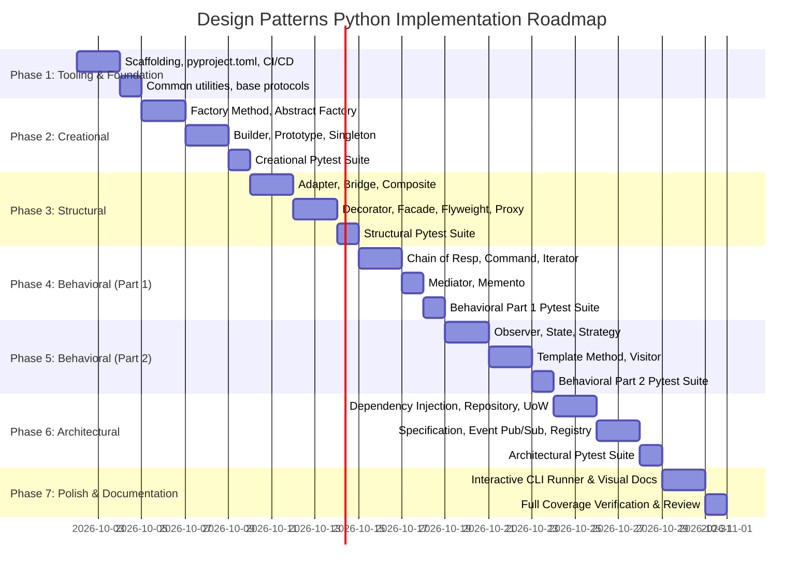

# Comprehensive Implementation Plan: Design Patterns in Python

## 1. Executive Summary & Vision

This repository (**`design_patterns`**) is dedicated to providing an exhaustive, modern, and production-grade guide to **Software Design Patterns implemented in Python 3.12+**.

### Core Tenets
1. **Modern Python Idioms**: Leverage modern Python features (`typing.Protocol`, `abc.ABC`, `dataclasses`, structural pattern matching `match/case`, `enum.StrEnum`, union types `X | Y`, and `collections.abc`).
2. **Before vs. After Comparison**: Every pattern demonstrates the naive/anti-pattern approach (tight coupling, violation of SOLID) followed by the refactored, pattern-based clean architecture.
3. **Pythonic Alternatives**: Highlight built-in Python language mechanisms that replace or simplify traditional GoF patterns (e.g., first-class functions for Strategy, decorators for Decorator, generators for Iterator, and module-level singletons).
4. **Real-World Scenarios**: Eschew toy examples (like `Animal -> Dog/Cat`) in favor of practical domain problems (payment gateways, ETL pipelines, caching layers, notification systems, and order workflows).
5. **Robust Test Suite**: 100% test coverage using `pytest` for all pattern implementations, verifying behavioral contracts, error handling, and edge cases.
6. **Zero External Dependencies for Core Patterns**: All standard GoF patterns will rely exclusively on the Python standard library.

---

## 2. Target Directory & Package Structure

```
design_patterns/
├── .github/
│   └── workflows/
│       └── ci.yml                     # Automated testing, linting (Ruff), and type checking (Mypy)
├── pyproject.toml                     # Modern build & tool configuration (ruff, mypy, pytest)
├── pytest.ini                         # Pytest configuration
├── README.md                          # Repository overview, roadmap, and quickstart
├── PLAN.md                            # This comprehensive plan
├── src/
│   └── design_patterns/
│       ├── __init__.py
│       ├── common/                    # Shared utilities, protocols, and exceptions
│       │   ├── __init__.py
│       │   └── logger.py
│       ├── creational/                # Creational Patterns
│       │   ├── __init__.py
│       │   ├── factory_method.py
│       │   ├── abstract_factory.py
│       │   ├── builder.py
│       │   ├── prototype.py
│       │   └── singleton.py
│       ├── structural/                # Structural Patterns
│       │   ├── __init__.py
│       │   ├── adapter.py
│       │   ├── bridge.py
│       │   ├── composite.py
│       │   ├── decorator.py
│       │   ├── facade.py
│       │   ├── flyweight.py
│       │   └── proxy.py
│       ├── behavioral/                # Behavioral Patterns
│       │   ├── __init__.py
│       │   ├── chain_of_responsibility.py
│       │   ├── command.py
│       │   ├── iterator.py
│       │   ├── mediator.py
│       │   ├── memento.py
│       │   ├── observer.py
│       │   ├── state.py
│       │   ├── strategy.py
│       │   ├── template_method.py
│       │   └── visitor.py
│       └── architectural/             # Enterprise & Modern Architectural Patterns
│           ├── __init__.py
│           ├── dependency_injection.py
│           ├── repository.py
│           ├── unit_of_work.py
│           ├── specification.py
│           ├── event_pubsub.py
│           └── registry.py
└── tests/
    ├── __init__.py
    ├── conftest.py
    ├── test_creational/
    │   ├── test_factory_method.py
    │   ├── test_abstract_factory.py
    │   ├── test_builder.py
    │   ├── test_prototype.py
    │   └── test_singleton.py
    ├── test_structural/
    │   ├── test_adapter.py
    │   ├── test_bridge.py
    │   ├── test_composite.py
    │   ├── test_decorator.py
    │   ├── test_facade.py
    │   ├── test_flyweight.py
    │   └── test_proxy.py
    ├── test_behavioral/
    │   ├── test_chain_of_responsibility.py
    │   ├── test_command.py
    │   ├── test_iterator.py
    │   ├── test_mediator.py
    │   ├── test_memento.py
    │   ├── test_observer.py
    │   ├── test_state.py
    │   ├── test_strategy.py
    │   ├── test_template_method.py
    │   └── test_visitor.py
    └── test_architectural/
        ├── test_dependency_injection.py
        ├── test_repository.py
        ├── test_unit_of_work.py
        ├── test_specification.py
        ├── test_event_pubsub.py
        └── test_registry.py
```

---

## 3. Standard Anatomy for Each Pattern Module

Each pattern file inside `src/design_patterns/<category>/<pattern_name>.py` must conform to the following standard template:

1. **Module Header & Documentation**:
   - **Classification**: (e.g., Creational / Structural / Behavioral)
   - **Intent**: Formal definition of what problem this pattern solves.
   - **Motivation / Real-World Analogy**: Concrete domain scenario (e.g., E-commerce checkout, Cloud multi-tenant provisioner).
   - **Mermaid Architecture Diagram**: ASCII/Mermaid sequence or class diagram embedded in the docstring.
2. **Anti-Pattern / Naive Implementation**:
   - Clearly annotated `NaiveImplementation` class illustrating code smells, tight coupling, or OCP/LSP violations.
3. **Clean / Refactored Implementation**:
   - Strict typing with `typing.Protocol` or `abc.ABC`.
   - Dataclasses for domain entities.
   - Clean separation of abstraction and implementation.
4. **Pythonic Alternative / Built-in Twist**:
   - Discussion and demonstration of how Python provides a language-native idiom (e.g., higher-order functions vs Strategy/Command class hierarchies; `functools.lru_cache` vs Flyweight/Proxy).
5. **Trade-offs (Pros & Cons)**:
   - When to use vs. when to avoid (complexity vs. extensibility).
6. **Executable Driver / Example**:
   - `if __name__ == "__main__":` block demonstrating interactive usage with informative output.

---

## 4. Detailed Pattern Catalog & Scope

### 4.1. Creational Patterns
*Deals with object creation mechanisms to decouple creation from use.*

| Pattern | Real-World Scenario | Pythonic Nuance / Key Concepts |
| :--- | :--- | :--- |
| **Factory Method** | Multi-channel Notification Dispatcher (Email, SMS, Slack, Push). | Parameterized factories vs registry-backed dispatch; dynamic subclass registration. |
| **Abstract Factory** | Cross-Platform Cloud Resource Provisioner (AWS, Azure, GCP buckets/VMs). | Enforcing consistency across related product families; abstract base protocols. |
| **Builder** | Complex SQL Query Builder or HTTP Request Configuration. | Fluent interfaces, step validation, immutability with frozen dataclasses. |
| **Prototype** | Document/Report Template Cloning with custom overrides. | `copy.deepcopy` vs custom `__copy__` / `__deepcopy__` hooks, prototype registries. |
| **Singleton** | Application Config Manager / Connection Pool. | Thread-safe `__new__`, Metaclass implementation, Borg (Monostate) pattern, and why Python modules are natural singletons. |

---

### 4.2. Structural Patterns
*Deals with object composition and identifying simple ways to realize relationships between entities.*

| Pattern | Real-World Scenario | Pythonic Nuance / Key Concepts |
| :--- | :--- | :--- |
| **Adapter** | Legacy Payment Gateway (XML/SOAP) to Modern Unified API (JSON/REST). | Object Adapter (composition) vs Class Adapter (multiple inheritance); Protocol duck-typing. |
| **Bridge** | Notification Messaging Abstraction & Delivery Channels (SMS, Email, Webhook). | Decoupling orthogonal dimensions: `Abstraction` (Alert types) vs `Implementor` (Channels). |
| **Composite** | Hierarchical File System / Organization Chart / UI Widget Tree. | Uniform treatment of leaf nodes and composite branches; recursion with generators. |
| **Decorator** | Web Request Middleware: Logging, Rate-Limiting, Authentication, Metrics. | Class-based decorators vs `functools.wraps` function decorators; stacking order. |
| **Facade** | Video/Audio Transcoding Subsystem (Audio codec, Video decoder, Bitrate optimizer). | Providing a simplified, intuitive entrypoint while preserving access to underlying subsystems. |
| **Flyweight** | Text Editor Glyph Rendering / Game Particle System (Snowflakes/Bullets). | Separation of intrinsic (shared) and extrinsic (context-specific) state; `__slots__` memory optimization. |
| **Proxy** | Lazy Database Loader, Caching Proxy, Protected Access Proxy. | `__getattr__` and `__setattr__` dynamic delegation; virtual proxies vs protection proxies. |

---

### 4.3. Behavioral Patterns
*Deals with algorithms, assignment of responsibilities, and communication between objects.*

| Pattern | Real-World Scenario | Pythonic Nuance / Key Concepts |
| :--- | :--- | :--- |
| **Chain of Responsibility** | Support Ticket Escalation / HTTP Request Filter Chain (Auth -> RateLimit -> Validation). | Linked-list chain vs list-based chain dispatch; terminating condition handling. |
| **Command** | Document Editor Actions with Undo/Redo History / Task Scheduling Queue. | Encapsulating method calls as first-class objects; closure/callable alternatives vs Command classes. |
| **Iterator** | Custom Data Structure Traversal (e.g., Binary Search Tree / Paginated API). | Implementing `__iter__` and `__next__`; Generator functions (`yield`) as Python's native iterator. |
| **Mediator** | Air Traffic Control / Multi-User Chatroom / Form Wizard Component Orchestration. | Eliminating direct many-to-many dependencies by centralizing interaction logic. |
| **Memento** | State Snapshot & Rollback for Financial Transactions / Text Document Revisions. | Immutability, encapsulation (originator vs caretaker), serialization via `pickle` or JSON. |
| **Observer** | Real-Time Stock Price Ticker / Event Notification System. | Pub/Sub model, weak references (`weakref`) to prevent memory leaks; async observer variants. |
| **State** | E-commerce Order Lifecycle (`Draft` -> `Placed` -> `Paid` -> `Shipped` -> `Delivered` -> `Cancelled`). | State transitions without sprawling `if/elif` statements; context delegation. |
| **Strategy** | Dynamic Pricing & Discount Calculation Engine (Black Friday, VIP, Coupon). | Function-based strategies via first-class callables vs class-based strategies. |
| **Template Method** | Data Mining & ETL Pipeline (Extract -> Clean -> Transform -> Load). | Base skeleton algorithm with abstract step hooks; Python's `abc.abstractmethod`. |
| **Visitor** | AST (Abstract Syntax Tree) Code Evaluator / Financial Portfolio Tax Calculator. | Double dispatch simulation in Python; `functools.singledispatch` and `singledispatchmethod`. |

---

### 4.4. Architectural & Modern Enterprise Patterns
*Patterns critical for scalable, maintainable Python backend architectures.*

| Pattern | Real-World Scenario | Key Concepts |
| :--- | :--- | :--- |
| **Dependency Injection** | Service Container for Decoupled Service Resolution. | Constructor injection, container registry, lifecycle scopes (singleton vs transient). |
| **Repository Pattern** | Decoupling Domain Models from Data Persistence (SQL / In-Memory). | Generic base repository, domain isolation from ORM/SQL details. |
| **Unit of Work** | Coordinating Atomic Business Transactions across Multiple Repositories. | Python context manager (`with UnitOfWork():`), commit and rollback semantics. |
| **Specification Pattern** | Complex Search / Filter Rules for Product Catalogs or User Eligibility. | Composable boolean logic (`Spec.and_(...)`, `Spec.or_(...)`, `Spec.not_()`). |
| **Event-Driven / Pub-Sub** | Domain Event Dispatcher for Microservices / Asynchronous Workflows. | Event bus, synchronous & asynchronous handlers, event envelopes. |
| **Registry Pattern** | Plugin System with Auto-Discovery & Dynamic Registration. | Decorator-based registration (`@register_plugin("name")`), dynamic module loading. |

---

## 5. Phased Implementation Roadmap



### Detailed Phase Breakdown:

- **Phase 1: Environment & Tooling Setup**
  - Initialize `pyproject.toml` with configurations for:
    - **Ruff** (linting and formatting)
    - **Mypy** (strict static type checking)
    - **Pytest** with `pytest-cov`
  - Setup `.github/workflows/ci.yml` for automated CI testing across Python 3.10, 3.11, and 3.12.
  - Create package hierarchy under `src/design_patterns/` and test layout.

- **Phase 2: Creational Patterns**
  - Implement 5 Creational patterns (`factory_method`, `abstract_factory`, `builder`, `prototype`, `singleton`).
  - Implement full pytest test suite in `tests/test_creational/`.

- **Phase 3: Structural Patterns**
  - Implement 7 Structural patterns (`adapter`, `bridge`, `composite`, `decorator`, `facade`, `flyweight`, `proxy`).
  - Implement full pytest test suite in `tests/test_structural/`.

- **Phase 4: Behavioral Patterns (Part 1 - Flow & Decoupling)**
  - Implement `chain_of_responsibility`, `command`, `iterator`, `mediator`, `memento`.
  - Implement corresponding pytest tests.

- **Phase 5: Behavioral Patterns (Part 2 - Coordination & Algorithms)**
  - Implement `observer`, `state`, `strategy`, `template_method`, `visitor`.
  - Implement corresponding pytest tests.

- **Phase 6: Architectural & Enterprise Patterns**
  - Implement `dependency_injection`, `repository`, `unit_of_work`, `specification`, `event_pubsub`, `registry`.
  - Implement corresponding pytest tests.

- **Phase 7: CLI Runner, Documentation & Polish**
  - Create an interactive CLI (`python -m design_patterns.cli`) allowing users to inspect, run, and benchmark any pattern interactively.
  - Finalize `README.md` with complete pattern index, quickstart instructions, and navigation tables.

---

## 6. Verification & Quality Gates

Each pattern implementation must pass the following quality checks:

1. **Static Analysis**:
   ```bash
   ruff check src tests
   ruff format --check src tests
   ```
2. **Type Safety**:
   ```bash
   mypy src tests --strict
   ```
3. **Unit Tests & Code Coverage**:
   ```bash
   pytest tests/ --cov=design_patterns --cov-report=term-missing --cov-fail-under=95
   ```
4. **Execution Integrity**:
   Each module can be executed directly as a standalone script:
   ```bash
   python -m design_patterns.structural.adapter
   ```
